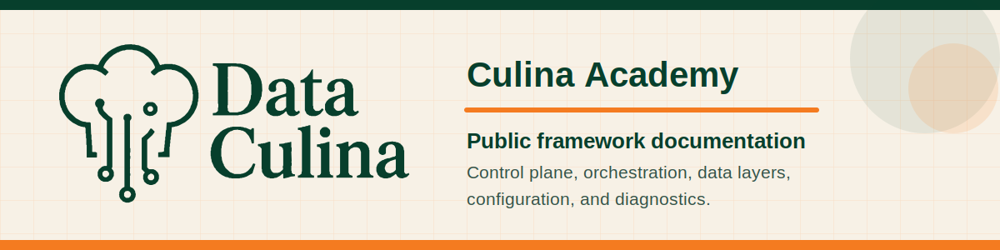

<p align="center">
  
</p>

# Culina Academy

Public operating documentation, examples, and workbook exercises for the Data Culina framework.

This repository is for clients, implementation partners, and users who need to understand what is running in their environment, how the framework is organized, and how to diagnose issues when the engine reports unexpected behavior.

<p>
  <a href="docs/getting-started/quickstart.md"><strong>Start with the quickstart</strong></a>
  &nbsp;|&nbsp;
  <a href="#local-reading"><strong>Run the local academy home</strong></a>
  &nbsp;|&nbsp;
  <a href="docs/troubleshooting/engine-diagnostics.md"><strong>Diagnose engine behavior</strong></a>
</p>

## Use This Repo

| Learn the framework | Configure work | Operate and diagnose |
| --- | --- | --- |
| [What Is Culina?](docs/getting-started/what-is-culina.md)<br>[Quickstart](docs/getting-started/quickstart.md)<br>[Framework Overview](docs/getting-started/framework-overview.md)<br>[Framework Architecture](docs/architecture/framework-architecture.md)<br>[Control Plane Structure](docs/architecture/control-plane.md)<br>[Control Plane Schema](docs/architecture/control-plane-schema.md)<br>[Data Layers](docs/architecture/data-layers.md) | [Configuration Examples](docs/configuration/config-examples.md)<br>[Sandbox Client Metadata Example](docs/configuration/sandbox-client-example.md)<br>[Config Field Reference](docs/reference/config-field-reference.md)<br>[Config Validation](docs/reference/config-validation.md)<br>[Add REST Ingestion](docs/guides/add-rest-ingestion.md)<br>[Add Transformation](docs/guides/add-transformation.md)<br>[Dependencies And Validation](docs/guides/dependencies-and-validation.md) | [Operating Guide](docs/operations/operating-guide.md)<br>[Diagnostic Queries](docs/troubleshooting/diagnostic-queries.md)<br>[Backfill And Recovery](docs/operations/backfill-and-recovery.md)<br>[Engine Diagnostics](docs/troubleshooting/engine-diagnostics.md)<br>[Incident Walkthroughs](docs/troubleshooting/incident-walkthroughs.md)<br>[Support Model](docs/troubleshooting/support-model.md)<br>[Workbook Exercises](workbook/README.md) |

## Repository Scope

This repo documents the public framework structure and day-to-day operating model:

- control plane concepts and responsibilities
- high-level orchestration plane layers
- data processing layers used by the framework
- sandbox-style V2 configuration examples
- full sandbox client metadata examples
- JSON Schema validation for compact V2 examples
- ingestion and transformation job patterns
- operating and diagnostic workflows
- incident walkthroughs and support handoff expectations
- optional workbook exercises
- common terminology

The docs focus on framework operation, configuration structure, and supportability. Package source code and consulting methodology are maintained separately.

## Project Files

- [Support](SUPPORT.md)
- [Security](SECURITY.md)
- [Changelog](CHANGELOG.md)
- [License](LICENSE)
- [Version Compatibility](docs/reference/version-compatibility.md)

## Local Reading

You can read the Markdown files directly in GitHub. You can also open `index.html` locally for a lightweight documentation landing page:

```powershell
python -m http.server 8000
```

Then open `http://localhost:8000`.

## Maintainer Validation

```powershell
npm test
npm run validate:content
npm run validate:schemas
```
