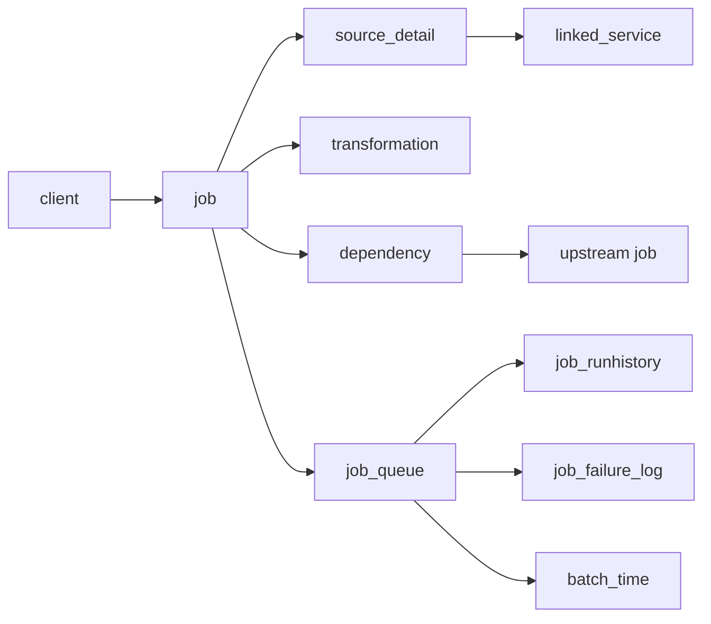

# Control Plane Schema

The Culina control plane is a metadata-backed operating model. It describes client scope, work definitions, source access, transformation logic, dependency order, runtime status, retry behavior, and diagnostic evidence.

This page documents the logical schema clients should understand when operating or diagnosing a Culina-managed environment.

## Entity Map



## Configuration Tables

| Table | Purpose | Key fields | Operating use |
| --- | --- | --- | --- |
| `client` | Defines a tenant, client, or workspace boundary. | `id`, `name`, `contractVersion`, audit fields. | Confirms which client context owns the work. |
| `job` | Defines framework-managed work. | `id`, `clientId`, `jobType`, `entityName`, `frequencyGroup`, `maxRetryCount`, `retryDelayBackoff`, `isActive`. | Answers what should run, what layer it targets, and whether it participates in operation. |
| `linked_service` | Defines an external source or connection profile. | `id`, `clientId`, `sourceName`, `sourceType`, `configJson`. | Shows the endpoint, protocol, auth mode, and request options used by ingestion. |
| `source_detail` | Defines how an ingestion job reads, flattens, and lands source data. | `id`, `jobId`, `sourceEntityName`, `sourceSelectQuery`, `sourceDeltaColumn`, `deltaOrFull`, `linkedServiceConfigId`, `landingFileExtension`, `deltaFileExtension`, `stagingTableName`, `fallbackWatermark`. | Explains full vs delta intake, target staging table, source path, request parameters, and flattening rules. |
| `transformation` | Defines the transformation controller configuration for modeled jobs. | `id`, `jobId`, `transformationType`, `transformationName`, `parameters`, validation flags, `initialLoad`, `isActive`. | Shows source tables, target table, business keys, filters, write mode, and step sequence. |
| `dependency` | Defines upstream readiness requirements. | `id`, `jobId`, `dependentJobId`. | Explains why a job may be waiting or skipped because upstream work is incomplete or failed. |

## Runtime Tables

| Table | Purpose | Typical fields | Operating use |
| --- | --- | --- | --- |
| `batch_time` | Tracks batch-level execution windows and lifecycle. | Batch id, start time, end time, batch status. | Confirms whether a batch is active, closing, completed, or stalled. |
| `job_queue` | Tracks queued work and current operational status. | Queue id, batch id, job id, status, retry count, timestamps. | Primary triage signal for `PENDING`, `IN_PROGRESS`, `ON_HOLD_RETRY`, `FAILED`, `COMPLETED`, and `SKIPPED`. |
| `job_runhistory` | Records step-level execution evidence. | Queue id, step name, start time, end time, status, output metadata. | Shows which execution step actually ran and where behavior changed. |
| `job_failure_log` | Records failure context. | Queue id, job id, failure time, failed step, error category, error message. | Provides the evidence needed for diagnosis and support handoff. |
| Dependency and impact views | Resolve upstream and downstream job relationships. | Job ids, dependency status, impacted downstream jobs. | Identifies the earliest upstream failure and downstream jobs affected by it. |

## Status Model

| Status | Meaning | Operator response |
| --- | --- | --- |
| `PENDING` | Work is queued but has not started. It may still be dependency-blocked. | Check dependency and readiness evidence before treating it as stuck. |
| `IN_PROGRESS` | Work has been dispatched and is active. | Check run history and elapsed time before resetting anything. |
| `ON_HOLD_RETRY` | Work failed but remains retry-eligible. | Confirm retry policy and determine whether the cause is transient. |
| `FAILED` | Work reached a terminal failure for the current run. | Diagnose the first failing upstream row, fix the cause, then choose a controlled recovery scope. |
| `COMPLETED` | Work completed successfully. | Do not reset this row during normal rerun handling. |
| `SKIPPED` | Work did not run because a prerequisite failed or was not satisfied. | Diagnose the upstream cause first. |

## Relationship Rules

1. `client.id` scopes jobs, linked services, and source definitions.
2. `job.id` is the central join key for ingestion, transformation, dependency, queue, history, and failure records.
3. Ingestion jobs use `source_detail.jobId` plus `linkedServiceConfigId` to identify the source endpoint and read shape.
4. Transformation jobs use `transformation.jobId` and `parameters` to identify source tables, target table, business keys, filters, and ordered steps.
5. `dependency.jobId` points to the downstream job; `dependency.dependentJobId` points to the upstream job.
6. Runtime diagnosis should start at `job_queue`, then move to `job_failure_log`, `job_runhistory`, and dependency views.

## Configuration JSON Fields

Several control records store structured JSON as string fields because the control plane persists configuration records while allowing flexible source and transformation shapes.

| Field | Found in | Structure |
| --- | --- | --- |
| `configJson` | `linked_service` | Endpoint, auth mode, timeout, headers, and other source access options. |
| `sourceSelectQuery` | `source_detail` | REST path or source query, request parameters, delta parameter mapping, flattening rules, output columns, and data types. |
| `parameters` | `transformation` | Source aliases, target definition, filters, business keys, write mode, and ordered transformation steps. |

## Example Mapping

The sandbox metadata examples under `examples/metadata/data-culina-sandbox-test-client/` show the schema in file form:

| Folder | Table represented | Count |
| --- | --- | --- |
| `client/` | `client` | 1 |
| `jobs/` | `job` | 24 |
| `linked-services/` | `linked_service` | 6 |
| `source-details/` | `source_detail` | 13 |
| `transformations/` | `transformation` | 11 |
| `dependencies/` | `dependency` | 15 |

Read the sandbox files in this order when tracing a workflow:

```text
client -> job -> linked_service -> source_detail -> transformation -> dependency -> runtime evidence
```

## Operator Questions

Use the schema to answer these questions quickly:

- Is the job active and scoped to the expected client?
- Is this ingestion, transformation, or downstream modeled work?
- Which source endpoint or table does it read?
- Is the job full-load or delta-load?
- Which target table does it populate?
- Which upstream jobs must complete first?
- What retry policy applies?
- Which queue row first failed?
- Did the job fail in source intake, transformation logic, validation, or dependency handling?
