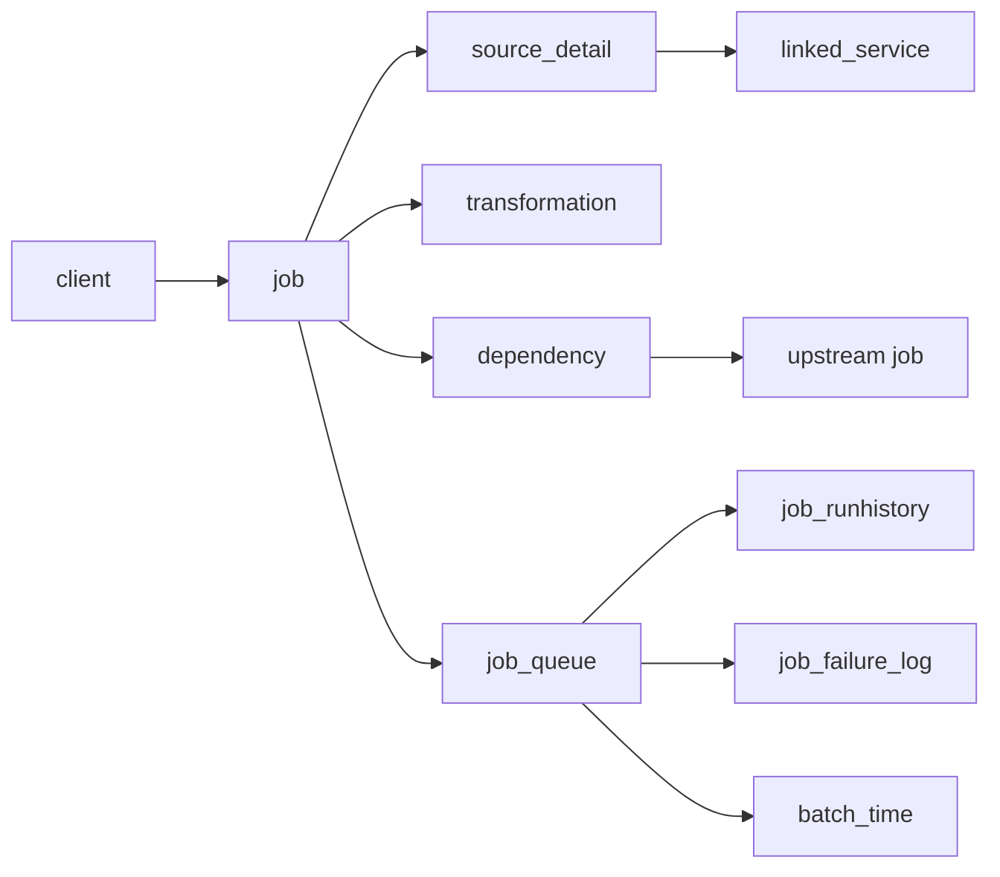
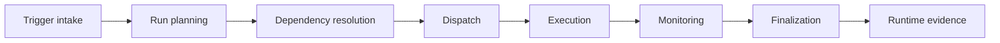
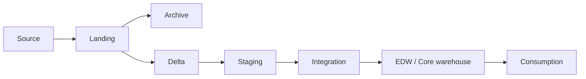
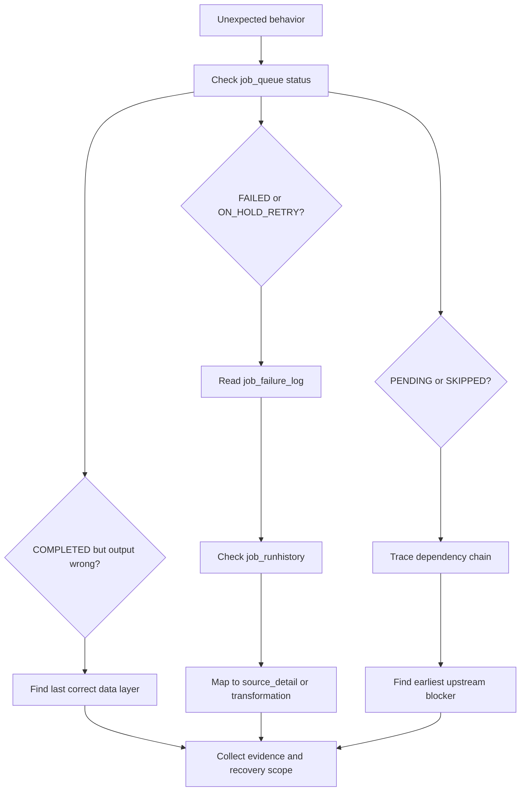

# Framework Architecture

This page gives clients and users a map of how Culina-managed work is configured, planned, executed, and diagnosed.

## Control Plane Entity Map

## Runtime Lifecycle

## Data Layer Flow

## Diagnostic Path

## How To Read The Architecture

- Use the control plane to understand what should exist and how work is connected.
- Use the orchestration plane to understand whether configured work was planned, dependency-ready, dispatched, and finalized.
- Use the data layers to locate where the data first differed from expectation.
- Use runtime evidence to decide whether to rerun, replay, backfill, rebuild, or escalate.
