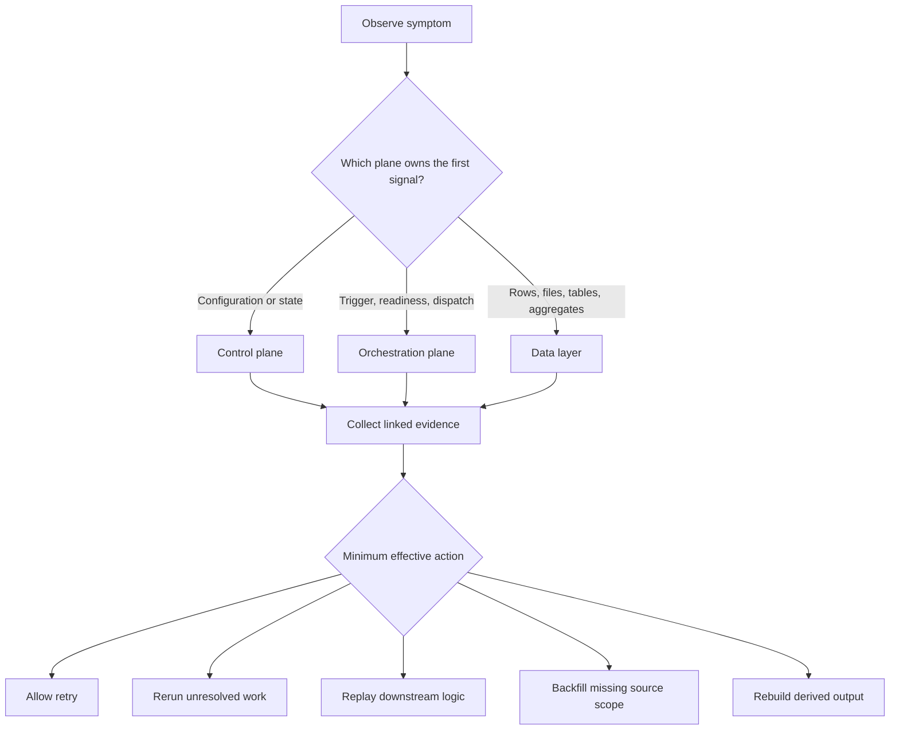

# What Is Culina?

Culina is a metadata-driven operating framework for data movement, transformation, orchestration, and support. It gives users a consistent way to describe work, run work, trace work, and diagnose work without treating every workflow as a custom one-off process.

## The Short Story

Most data operations fail in the gaps between intent, configuration, execution, and evidence. Culina closes those gaps by making each workflow visible through a shared control plane and a repeatable operating model.

The loop matters. A workflow is not only a pipeline. It is a managed unit of work with configuration, dependency rules, validation expectations, runtime state, and support evidence.

## What Culina Helps Users Do

| User question | Culina answer |
| --- | --- |
| What work exists? | Jobs, source details, transformations, dependencies, and validation records describe configured work. |
| What should run next? | Queue state and dependency readiness show whether work is runnable, blocked, skipped, failed, or complete. |
| Where did data change? | Layer boundaries show whether the issue is in landing, delta, staging, integration, EDW, or consumption. |
| Why did a run fail? | Failure logs, run history, job configuration, and source or transformation metadata connect symptoms to evidence. |
| How should recovery happen? | Rerun, replay, backfill, and rebuild decisions follow the failed layer and affected dependency scope. |

## Operating Model

This is the main diagnostic habit: classify the first reliable signal, collect linked evidence, and choose the smallest recovery action that matches the evidence.

## When Culina Fits

Culina is useful when a team needs:

- repeatable ingestion and transformation patterns
- visible dependency control between jobs
- consistent metadata for jobs, sources, transformations, and validation
- operational run evidence that support teams can interpret
- controlled recovery paths instead of broad blind reruns
- a shared language between client users, operators, and implementation partners

## When A Different Approach May Fit Better

A different approach may be simpler when the work is:

- a one-time file conversion with no ongoing operation
- an ad hoc analysis that does not need orchestration or supportability
- a workflow with no dependency, validation, recovery, or audit requirement
- a prototype where speed matters more than repeatable operation

## First Reading Path

1. [Quickstart: Trace A Workflow](quickstart.md)
2. [Framework Architecture](../architecture/framework-architecture.md)
3. [Configuration Examples](../configuration/config-examples.md)
4. [Diagnostic Queries](../troubleshooting/diagnostic-queries.md)
5. [Incident Walkthroughs](../troubleshooting/incident-walkthroughs.md)
