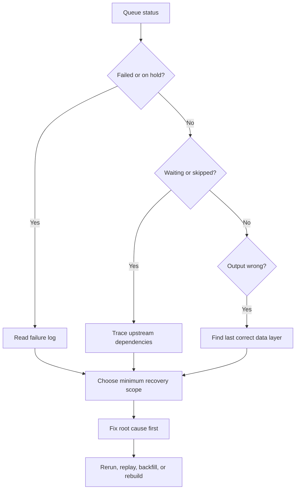

# Diagnostic Queries

Use these examples as starting points when investigating Culina runtime behavior. Table and column names may vary by deployment, but the pattern should stay the same: start from queue state, join to configuration, then collect run and failure evidence.

## 1. Find Current State For One Workflow

```sql
select
  q.queue_id,
  q.batch_id,
  q.job_id,
  j.entity_name,
  q.status,
  q.attempt_count,
  q.created_at,
  q.started_at,
  q.completed_at
from job_queue q
join job j
  on j.id = q.job_id
where j.entity_name = 'STG.JsonPlaceholder_Posts'
order by q.created_at desc;
```

Healthy signal:

| queue_id | entity_name | status | attempt_count |
| ---: | --- | --- | ---: |
| 90001 | STG.JsonPlaceholder_Posts | COMPLETED | 1 |

Risk signal:

| queue_id | entity_name | status | attempt_count |
| ---: | --- | --- | ---: |
| 90002 | STG.JsonPlaceholder_Posts | ON_HOLD_RETRY | 3 |

If the row is `ON_HOLD_RETRY` or `FAILED`, move to failure evidence before rerunning.

## 2. Read Failure Evidence

```sql
select
  f.queue_id,
  f.job_id,
  j.entity_name,
  f.error_stage,
  f.error_message,
  f.created_at
from job_failure_log f
join job j
  on j.id = f.job_id
where f.queue_id = 90002
order by f.created_at desc;
```

Use the error stage to decide whether to inspect source detail, transformation parameters, dependency readiness, or platform execution evidence.

## 3. Compare Run History Steps

```sql
select
  h.queue_id,
  h.step_name,
  h.status,
  h.started_at,
  h.completed_at,
  h.row_count,
  h.message
from job_runhistory h
where h.queue_id = 90002
order by h.started_at;
```

Expected use:

- find the last successful step
- find the first failed step
- map that step back to source detail or transformation metadata
- avoid resetting downstream work before the first failed upstream job is understood

## 4. Trace Waiting Work To Upstream Blockers

```sql
select
  down.entity_name as downstream_job,
  up.entity_name as upstream_job,
  uq.status as upstream_status,
  uq.queue_id as upstream_queue_id
from dependency d
join job down
  on down.id = d.downstream_job_id
join job up
  on up.id = d.upstream_job_id
left join job_queue uq
  on uq.job_id = d.upstream_job_id
 and uq.batch_id = :current_batch_id
where down.entity_name = 'INT.Blog_Post_Engagement'
order by up.entity_name;
```

If any upstream row is `FAILED`, `ON_HOLD_RETRY`, `IN_PROGRESS`, or missing from the current batch, the downstream job should not be treated as independently broken.

## 5. Map Ingestion Failure To Source Metadata

```sql
select
  j.entity_name,
  sd.linked_service_config_id,
  sd.delta_or_full,
  sd.staging_table_name,
  sd.source_select_query
from job j
join source_detail sd
  on sd.job_id = j.id
where j.entity_name = 'STG.JsonPlaceholder_Posts';
```

Check:

- linked service endpoint and auth mode
- REST path and request parameters
- flattening columns and data types
- delta or full-load behavior
- expected staging table

## 6. Map Transformation Failure To Step Metadata

```sql
select
  j.entity_name,
  t.parameters
from job j
join transformation t
  on t.job_id = j.id
where j.entity_name = 'INT.Blog_Post_Engagement';
```

Check:

- `parameters.sources`
- `parameters.target`
- `parameters.transformation.steps`
- duplicate-key and null-key validation flags
- write mode and business keys

## 7. Decide Recovery Scope



Use [Backfill And Recovery](../operations/backfill-and-recovery.md) after the first failed scope is known.
